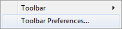
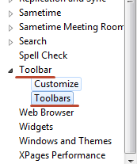
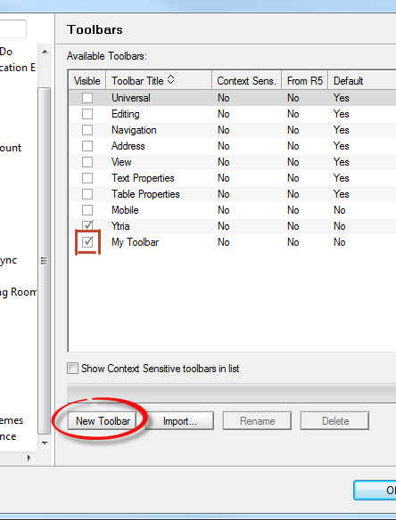
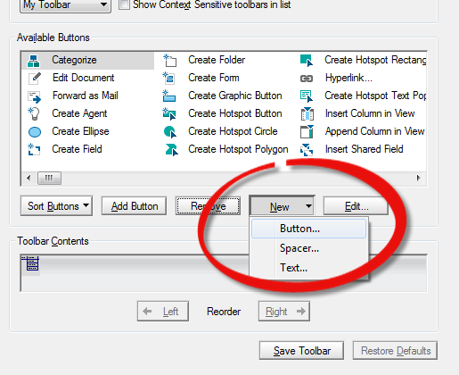
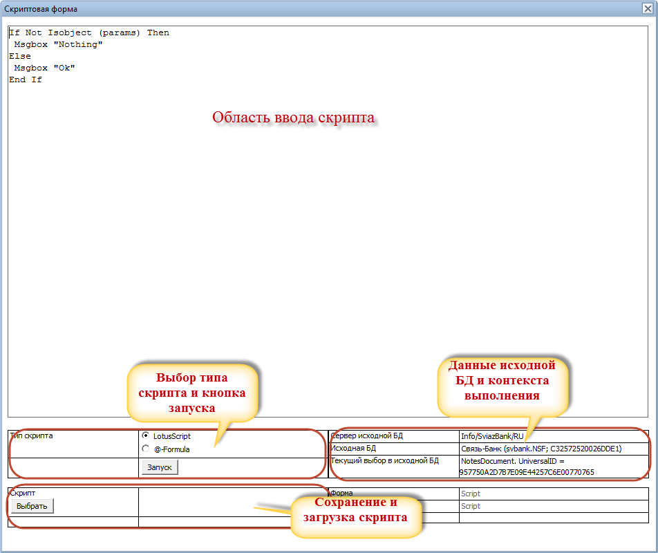

# LS Runtime Scripter

## Краткое описание
Выполнение скрипта или @-формулы "налету" в базе над документом или коллекцией, без внесения изменений в дизайн базы
* Текущая версия: 1.1.1
* Лицензия: [MIT](https://opensource.org/licenses/MIT)

### Назначение и возможности
1. Выполнение скрипта в нужной базе (документами) без изменения дизайна базы - для небольших правок или пересчетов нет необходимости писать агент в базе.
2. Для исполнения скрипта, изменяющего документ достаточно авторского доступа к нему
3. Сохранение написанных скриптов, загрузка ранее сохраненных скриптов
4. Выбор типа скрипта между LotusScript и @-Formula
5. Выполнение скрипта в контекста коллекции документов или одного документа

## Настройка
1. Нажать правой клавишей мыши на панеле инструментов (Toolbar)  

2. Выбрать Настройки панели инструментов (Toolbar Preferences...)  

ПРИМЕЧАНИЕ: Шаги с 3 по 4 опциональны. Кнопку можно добавить в любую имеющуюся панель
3. Перейти в раздел Панель инструментов -> Панели (Toolbar -> Toolbars)  

4. Создать панель и отметить, что она должна быть отображена  

5. Перейти в раздел Панель инструментов -> Пользовательская настройка (Toolbar -> Customize)
6. Выбрать панель, на которой будет размещена кнопка
7. Нажать Новая -> Кнопка (New -> Button)  

8. В поле формула написать:
@Command( [FileOpenDatabase]; "ИМЯ_СЕРВЕРА" : "ПУТЬ_К_БАЗЕ" ; "ScriptView" ; ""; "1"; "1" )
9. Нажать ОК в обоих диалогах

## Использование
1. Нужно находиться в базе (открыть ее), где предполагается выполнение скрипта
2. Определить над чем будет выполнен скрипт
- Выделить документы, если скрипт должен быть выполнен над коллекцией документов. @-Formula в этом случае будет выполнятся в контексте каждого отдельного документа из коллекции
- Поставить курсор или открыть документ, если скрипт должен быть выполнен над документом. При этом @-Formula будет выполняется в контексте выделенного документа

3. Нажать на кнопку запуска On-Line Scripter в панели инструментов
4. После запуска вы можете увидеть в контексте какой базы и какого выбор будет выполнятся написанный скрипт
5. В поле для написания скрипта пишется сам скрипт
6. Ниже указывается его тип
7. Нажать "Запуск" для выполнения скрипта  

## Сохранение и загрузка скрипта
Вы можете сохранить имеющийся скрипт, задав его название, описание (по желанию) и доступность другим пользователям Runtime Scripter.
Есть 2 режима доступности скрипта:
- личный (загрузка и изменение доступны только тому, кто создал скрипт)
- публичный (загрузка и изменение доступны всем пользователям Runtime Scripter)

## Получение доступа к глобальным параметрам
Для типа скрипта LotusScript доступ к глобальным параметрам может быть получен через:
params.Server - Имя сервера
params.Db - Объект базы данных
params.Col - коллекция документов, в случае, если выделены документы
params.Doc - документ, в случае, если курсор стоит на документе или сам документ открыт

Можно так же воспользоваться кнопкой над полем со скриптом Add global param и выбрать нужный параметр из списка доступных - он будет добавлен в конец скрипта
